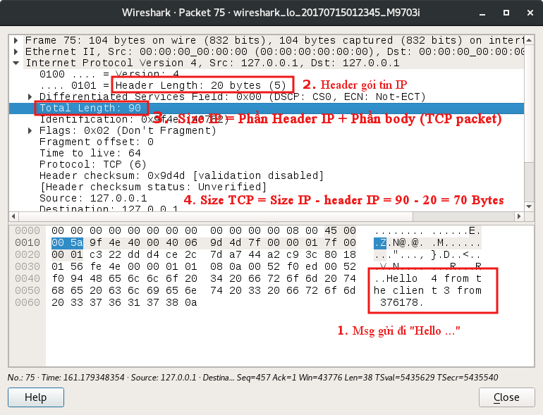

# Measure Packet

All file

- Consts: Constant variable
- RecvTCP: Send TCP packet
- RecvUDPSendTCP: Receive UDP packet and send TCP packet
- SendUDP: Send UDP packet 

 `Note` Create file `assets/output.csv` before you run project

The file `simulation` format `MSG , timestamp from node sending , timestamp from border-router receiving`  

The file `output` format `MSG , timestamp from node sending , timestamp from border-router receiving, latency RN, timestamp from RN`

- Start QEmu `$ qemu-system-arm -kernel kernel-qemu-3.10.25-wheezy -cpu arm1176 -m 256 -M versatilepb -serial stdio -append "root=/dev/sda2 roofstype=ext4 rw" -hda 2015-02-16-raspbian-wheezy.img -redir tcp:2222::22`

## Run

- First run file `$ java RecvTCP`
- Second run `$ java RecvUDPSendTCP`
- Third run `$ java SendUDP`

## Env

- Buffer size: 128 MB
- TCP packet size: 90 - 20 = 70 Bytes

## Auth: Tuyenng
